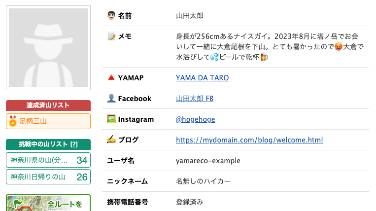

# ヤマレコ プロフィール補足情報表示

ヤマレコのユーザープロフィールページに、事前に定義した補足情報（名前、SNSリンク、メモなど）を表示する Tampermonkey スクリプトです。

メモ: YAMAP版はこちら ⇒ [yamap-profile-moreinfo](https://github.com/bunatree/yamap-profile-moreinfo)

## 💡 機能

- ユーザーIDごとに補足情報を定義可能
- 補足情報は、プロフィール欄の冒頭または末尾に追加表示されます
- 補足情報は、スクリプト内に記述、またはGoogleスプレッドシートに作成
- 表示項目は「ラベル」「値（テキストまたはリンク）」に対応
- Instagram、Facebook、YAMAP など、外部サービスのリンクもOK

## 📸 動作イメージ

Web版のユーザープロフィールページに、下図のような補足情報を表示します。



## ⚙️ 利用方法

### 1. 必要な準備

- ブラウザーに [Tampermonkey](https://www.tampermonkey.net/) 拡張機能をインストール
- Chrome の場合は、右上の [⋮] メニュー → [拡張機能] → [拡張機能を管理] → 右上の [デベロッパーモード] スイッチをON

### 2. スクリプトの導入

1. Tampermonkey ダッシュボードで「新規スクリプト」を作成
2. スクリプト欄に `userscript.js` の内容をコピー＆ペースト
3. 以下の設定を変更・追加してください：

| 変数名               | 説明 |
|----------------------|------|
| `obtainDataMethod`   | `localJson` ... 補足情報をスクリプト内に記述する場合<br>`googleSpreadsheet` ... 補足情報をGoogleスプレッドシートに記述する場合 |
| `userData`           | `localJson` を選んだ場合、ここに補足情報を記述（後述の 3. を参照） |
| `googleSpreadsheetId` or `googleSpreadsheetUrl` | スプレッドシート利用時にどちらかを指定（後述の 4. を参照）|
| `insertPosition`     | 表示位置（`before` または `after`） |

ユーザーIDは、プロフィールページURLの「NNNN」の部分です。
https://www.yamareco.com/modules/yamareco/userinfo-NNNN-prof.html

### 3. スクリプト内に補足情報を記載する方法

`obtainDataMethod` で `localJson` を指定してください。

```js
const obtainDataMethod = 'localJson';
```

`localUserData` で、ユーザーIDと、そのユーザーに関する補足情報を記述します。

下記は、IDが「1234」と「5678」の2名のユーザーに関する例です。

- `label` ... プロフィール表の左側セルに見出しとして表示されます。
- `value` ... プロフィール表の右側セルにその内容として表示されます。
- `url` ... valueで指定された内容をリンクとして表示します。

```js
const localUserData = {
  "1234": [
    { label: "名前", value: "山田太郎" },
    { label: "メモ", value: "身長が256cmあるナイスガイ。2023年8月に塔ノ岳で会った。" },
    { label: "ヤマレコ", value: "YAMA DA TARO", url: "https://www.yamareco.com/modules/yamareco/userinfo-0000-prof.html" },
    { label: "Facebook", value: "山田太郎 FB", url: "https://www.facebook.com/user/info/304904" },
    { label: "Instagram", value: "@hogehoge", url: "https://instagram.com/hogehoge" }
  ],
  "5678": [
    { label: "名前", value: "山田花子" },
    { label: "メモ", value: "2022年6月に青ヶ岳山荘で会った。" },
    { label: "YouTube チャンネル", value: "花子の山てくてく", url: "https://youtube.com/channel/abcd0000" },
    { label: "ブログ", url: "https://example.com/blog/welcome.html" }
  ]
};
```

### 4. Google スプレッドシートからデータを読み込む方法

`obtainDataMethod` で `googleSpreadsheet` を指定してください。

```js
const obtainDataMethod = 'googleSpreadsheet';
```

下記は、IDが「1234」と「5678」の2名のユーザーに関する例です。

1. Google スプレッドシートを作成し、以下のような形式で記述します。

| userId | label      | value        | url                          |
|--------|------------|--------------|-------------------------------|
| 1234   | 名前       | 山田太郎     |                               |
| 1234   | Facebook   | 山田太郎FB   | https://facebook.com/xxxxx   |
| 5678   | メモ       | 2025年1月に… |                               |

2. [ファイル] → [共有] で表示される設定ダイアログの [一般的なアクセス] で [リンクを知っている全員] に設定します。

3. 公開されたURLをコード内の `spreadsheetUrl` 変数に記述するか、ドキュメントのIDを `googleSpreadsheetId` 変数で指定してください。`googleSpreadsheetId` を指定する場合は `spreadsheetUrl` の値を空（から）にしてください。

> ⚠️ **セキュリティに関する注意**
>
> - 上記の設定をすると、リンクを知っているすべての人がスプレッドシートの内容を閲覧できます。
> - URLが第三者に漏洩した場合、記載された情報（本名・メモ内容など）も見られる可能性があります。
> - 万が一に備え、**実名の記載やセンシティブな個人情報の掲載は避けてください。**
> - このスクリプトやスプレッドシートによる情報漏洩について、作者は一切の責任を負いません。

## ❓ よくある質問とトラブル対処

### Q1. 補足情報は他の人にも見られちゃうの？

- いいえ、あなたが追加した補足情報は、あなた用のメモです。あなたのブラウザーにだけ表示されます。
- Tampermonkeyが動作しているブラウザー、つまりあなたの画面表示を加工しているだけです。
- あなたが追加した補足情報が他の人の画面に表示されることはありません。

### Q2. 正しく設定しているはずなのに、画面に反映されません

- 拡張機能の「デベロッパーモード」を許可する必要があります。
  - Chrome の場合は、右上の [⋮] メニュー → [拡張機能] → [拡張機能を管理] → 右上の [デベロッパーモード] スイッチがONになっているか確認してください。

### Q3. Googleスプレッドシートがうまく読み込まれません

- `googleSpreadsheetId` または `googleSpreadsheetUrl` の指定が正しいか確認
- スプレッドシートは [ファイル] → [共有] で表示される設定ダイアログの [一般的なアクセス] で [リンクを知っている全員] になっていますか？
- 公開URLの末尾が `/edit?...` の形式である場合、自動的に CSV URL に変換されます（スクリプトが対応済）

### Q4. セキュリティが不安です

- Googleスプレッドシートの公開URLが漏れると誰でも見られるため、**実名や連絡先の記載は避けてください**
- プライベートな内容はなるべく記載しないようにしましょう

## 🛠️ 開発の経緯

ヤマレコのユーザーといつどこでお会いしたのか忘れてしまうことはありませんか？ 私自身が忘れっぽいことに加えて、ユーザー名がFacebookやYAMAPなど他のSNSのユーザー名と異なるため、混乱することも多いです。

「いつどこでお会いしたのか」「他のSNSのどのユーザーとつながっているのか」を一元管理できるデータベースのようなものが欲しいと考えました。ヤマレコのプロフィールページに補足情報を追加することで、これを実現できるのではないかと思い、このスクリプトを開発しました。

このスクリプトを使うことで、他のユーザーとの再会時に話題をスムーズに共有できるようになると考えています。
